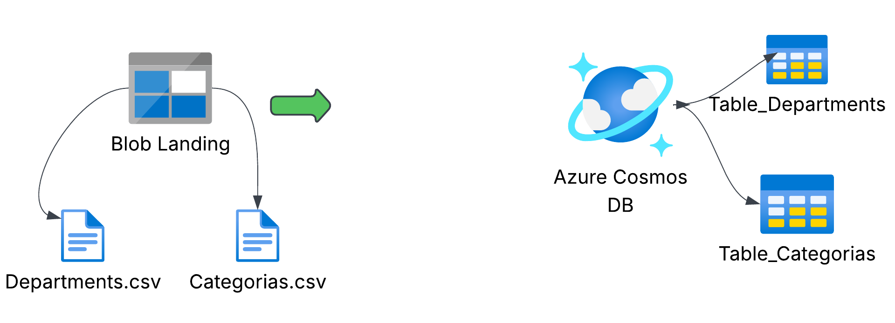
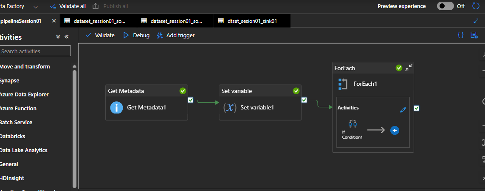
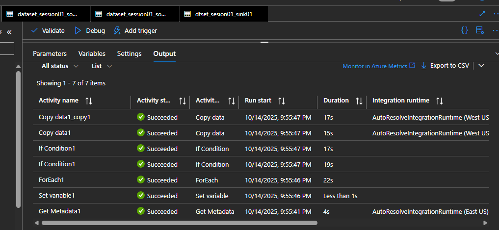
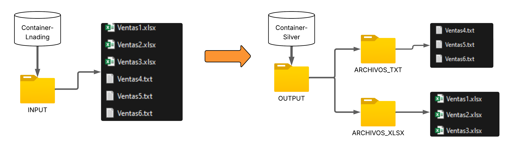
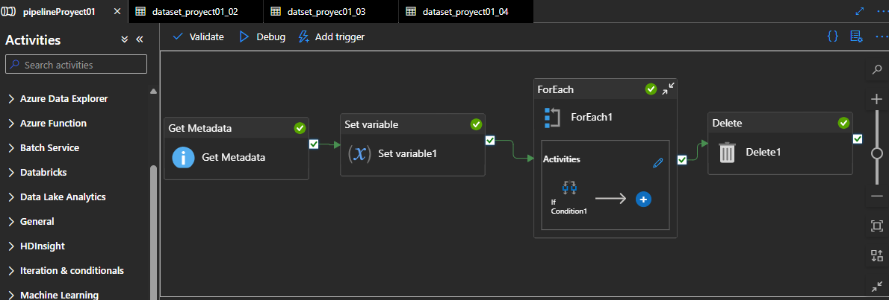
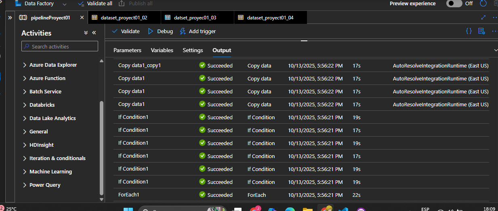
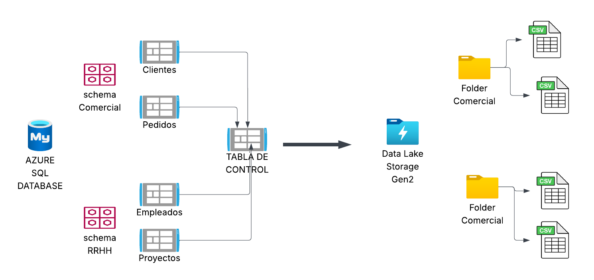
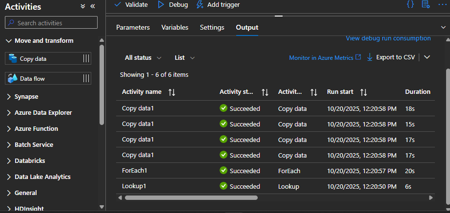

# PROYECTOS EN AZURE DATA FACTORY!

**AZURE DATA FACTORY:** Servicio de integracion de datos dentros de Azure, es un orquestador
de pipelines(canalizaciones) que te permiten crear, automatizar flujo de trabajos para procesos
ETL  

**Ejecicio 01:** LLevar dos archivos csv a dos containers de COSMOSDB.

**Desarrollo:**
- Get Metada: Obtenmos los chilItemns como nombre y tipo
- Set variable:Obtiene la lista de los chilItems
- Iteracion ForEach: recorre la lista de cada valor del chilItems de los archivos
- CosmosDB: Creamos los container respectivos
- If Condicional anidado: Verifica si el nombre de un archivos coincide con un string con la funcion equals
- Copy data anidado: si la condicion es verdadera copia el archivo Departmets.csv, caso contrario copia Categories.csv
- For Each: Bucle que va a ir recorriendo y ver las extensiones para llevarlo a su respectiva carpeta
- Fin Proyect:Copia de dos acrchivos csv y lo lleva un container de ConsmosDB
- Thank you¡

**Ejecicio 02:** Tengo un container con la carpeta input dentro de ella archivos con extensiones txt, y xlsx , la finalidad es llecarlo a otro contendor conde este en carpetas separadas con sus respectivas extensiones .

**Desarrollo:**
- Get Metada: Obtenmos los chilItemns como nombre y tipo
- Set variable:Obtiene la lista de los chilItems
- Iteracion ForEach: recorre la lista de cada valor del chilItems
- If Condicional anidado: Verifica si la extension comienza con txt, o si es xlsx
- Copy data anidado: dentro de if hay dos copy data que sirve para copiar los archivos dependiendo de su tipo de extension
- For Each: Bucle que va a ir recorriendo y ver las extensiones para llevarlo a su respectiva carpeta
- Delete: los archivos anteriores en su ruta original se eliminan
- Fin Proyect:Copia de multiples archivos con bucles y condicionales anidados
- Thank you¡

**Ejecicio 03:** LLevar dos tablas de base de datos de AZURE SQL DATABASE , mediante 
la actividad de LOOKUP y iteraciones, a un data lake 

**Desarrollo:**
- Lookup: Obtenmos registros de la tabla de control como el schema y el nombre de tabla
- Set variable:lo guardamos en una variable (array)
- Iteracion ForEach: recorre la lista para obtener su schema y nombre de archivo de cada registro
- Se almacena en un AZURE DATALAKE STORAGE GEN2 en sus respecticas carpetas con nombre del schema
- Thank you¡

